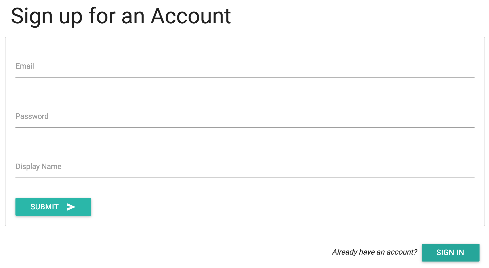
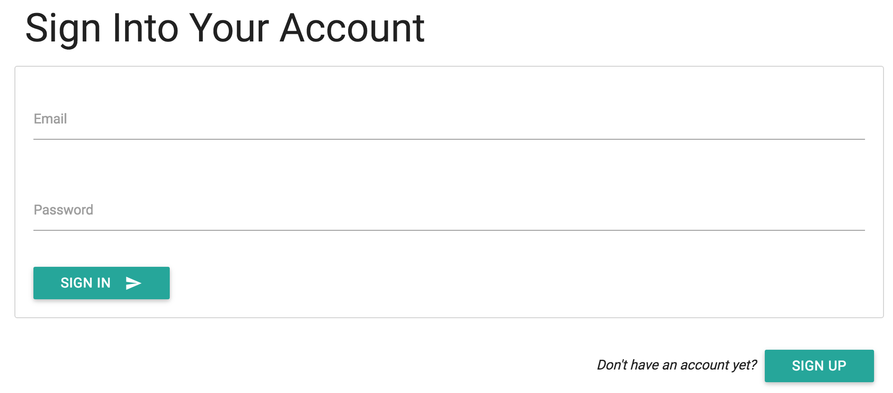
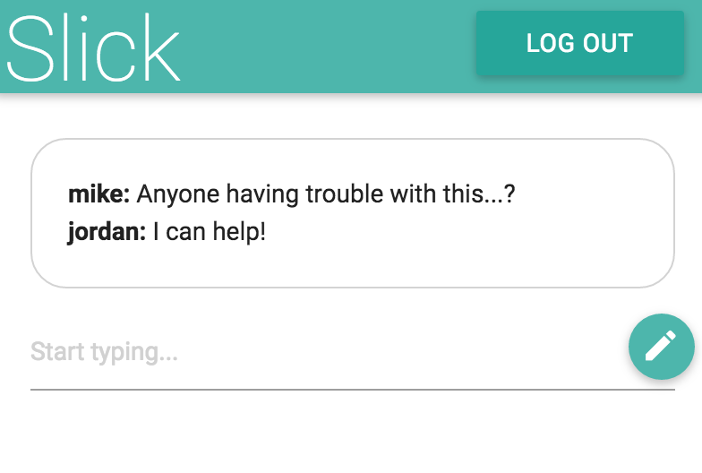

# Exercise-1
In this exercise, you'll learn how to enforce user authentication for the data storage service Firebase, and practice using your jQuery skills. Unlike previous applicaitons, we'll build three different `*.html` pages for a sign-in page (`sign-in.html`), a sign-up page (`sign-up.html`), and the main content (`index.html`, a chat application). The final products will look like this:

`sign-up.html`:

`sign-in.html`:

`index.html` (very simple chat app):

As described in [module-4](https://github.com/info343c-a16/m4-git-intro), start by forking and cloning this repository. Then, complete the following sections.

## Set up
Following the instructions in this learning module, set up (and connect to) a Firebase database. This includes:

**On Firebase**
- Create a Firebase account
- Make a new Project on Firebase
- Enable Email and Password authentication for your project

**In Your Scripts**
- In your `authenticate.js` file, use the project configuration information to initialize a connection to Firebase

Note, each `*.html` file is already reading in `authenticate.js`, `main.js`, and the `firebase` script via CDN. Materialize is also loaded, though feel free to load a different CSS framework of your choice.

## Sign up Page
To create your sign up page, you'll need to build an HTML form, and then set the appropriate event listeners in your `authenticate.js` file

**In sign-up.html**
- Create an HTML form that allows a user to input an **email** (with `type=email`), a **password** (with `type=pasword`), and a **display name**. I suggest using a framework for styling/structure.
- Outside of your form, create a paragraph asking if the user already has an account, and make a button that links to `sign-in.html`

**In authenticate.js**
In this section, you'll write the `signUp` function to create a new Firebase user. In your function, you should do the following:

- Retrieve email, password, and display name from your form
- Use the email and password to create a new user using the `createUserWithEmailAndPassword` method
- When your create user promise completes, use the `.updateProfile` method to set the `displayName` property of your user
- After your `.updateProfile` promise resolves, you should use the `window.location` method to redirect to your `index.html` page
- Use the `.catch` method to catch any errors from your `createUserWithEmailAndPassword` function

After writing this function, you should **assign an event** to your form to execute the `signUp` function on `submit`. Remember, the `authenticate.js` file is loaded by all 3 `*.html` files, so make your selection carefully!

## Sign In page
Your sign-in page will look and function similarly to your sign-up page. Users should be able to use a form to sign in, and there should also be a link to the sign-up page if they don't have an account:

**In sign-in.html**
- Create an HTML form that allows a user to input an **email** (with `type=email`), a **password** (with `type=pasword`). I suggest using a framework for styling/structure.
- Outside of your form, create a paragraph asking if the user already _does not_ have an account, and make a button that links to `sign-up.html`

**In authenticate.js**
In this section, you'll write the `signIn` function to sign into Firebase using existing account information. In your function, you should do the following:

- Retrieve email and password from your form
- Use the email and password to create a new user using the `signInWithEmailAndPassword` method
- When your sign in promise completes, you should use the `window.location` method to redirect to your `index.html` page
- Use the `.catch` method to catch any errors from your `signInWithEmailAndPassword` function

After writing this function, you should **assign an event** to your form to execute the `signIn` function on `submit`. Remember, the `authenticate.js` file is loaded by all 3 `*.html` files, so make your selection carefully!

## Check authentication
We'll want to set up auto-redirects so that if users are already logged in, they are redirected to the main application. Similarly, if they aren't logged in, they should be redirected to the `sign-in.html` page. In your `authenticate.js` file, you should do the following:

- Using the `onAuthStateChanged` method, listen to changes in authentication
- If there is a user, but they are not on the `index.html` page, redirect them there
- If there is _not a user_ but the _are_ on the `index.html` page, redirect them to the `sign-in.html` page
- Use JavaScript logic to make sure this function is only executed once (see suggestion in learning module)

## SignOut Function
As you might imagine, we won't have a signOut page, but we will have a signOut button on the `index.html` page. In order to provide a UI for logging out, you should do the following:

**In authenticate.js**
- In your `signOut` function, use the appropriate method to signOut of the user account
- When the user successfully logs out, you should redirect to the `sign-in.html` page

After writing this function, you should **assign an event** to your `#log-out` button to execute this function.

## Main Page
The main page of your application is a simple chat UI. The `index.html` file has already been built to have 3 components:

- A box for displaying chat messages (`#chat-box`)
- An input element (`#message`) and button (`#chat-button`) for writing chats
- A button to log-out (`#log-out`)

In your `main.js` file, you'll make this page come to life by doing the following:

- Create a reference to an object `chats` on Firebase
- Assign a `child_added` event to your `chats` reference. This is executed when each child is connected (i.e., on load) and each time a new child is added. In the event, you should pass each `id` and `value` to your `renderChat` function
- In your `renderChat` function, use **jQuery** to build a new chat element, and append it to your `#chat-box` element
- Assign an event listener on your `#chat-button` element in which you get the message and the current user, and push a _new object_ to your `chats` Firebase reference
